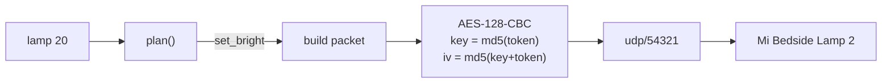

```
 ┃  ▄▄▄   ▗▄▄▄▖ ▗▖  ▗▖ ▗▄▄▖
 ┃ ▐▌  ▜▌ ▐▌ ▝▘ ▐▛▚▞▜▌ ▐▌ ▐▌
 ┃ ▐▌  ▐▌ ▐▛▀▀▘ ▐▌▝▘▐▌ ▐▛▀▘
 ┻ ▝▀▀▀▘ ▝▘     ▝▘  ▝▘ ▐▌
```

# lamp

Control the Mi Bedside Lamp 2 from the terminal. Entirely on your own network.

[](https://bun.sh)
[]()
[]()
[]()

```
lamp            # toggle
lamp 20         # 20% brightness
lamp 2700k      # warm white
lamp #ff3000    # colour
lamp @read      # a scene from your config
lamp status     # on  80%  4000K
```

No cloud round trip, no hub, no Xiaomi or Yeelight app in the loop. The lamp's
HomeKit pairing is untouched, so the Home app keeps working on your phone
exactly as before.

## Run it

```bash
git clone https://github.com/nitrimandylis/lamp.git
cd lamp
bun run compile   # → ~/.bun/bin/lamp, and man lamp into your manpath
lamp --help
man lamp          # full reference, offline
```

## Setting it up

Create `~/.config/lamp/config.toml` and `chmod 600` it:

```toml
ip = "192.168.1.4"
token = "0123456789abcdef0123456789abcdef"

[scenes.read]
brightness = 80
kelvin = 4000

[scenes.sleep]
brightness = 5
rgb = "#ff3000"
```

The token is a per-device credential, fetched once from the Xiaomi cloud
account the lamp is registered to. The
[Xiaomi cloud tokens extractor](https://github.com/PiotrMachowski/Xiaomi-cloud-tokens-extractor)
does this; use its QR-code login rather than typing a password, which avoids the
two-factor loop entirely.

Find the lamp's IP with `dns-sd -B _hap._tcp local` if you don't know it.

## Under the hood



A miIO packet is a 32-byte header — magic, length, device id, the device's own
clock, and an md5 checksum — wrapped around an encrypted JSON body. The first
datagram is a handshake that asks the lamp for its id and clock; everything
after that is a `set_bright` / `set_ct_abx` / `set_rgb` call.

Argument parsing is a pure function, `plan()`, which turns one argument into the
list of calls that carry it out. That is where the whole command vocabulary
lives and it is tested without a lamp on the network.

## Why not the Yeelight LAN protocol

The Mi-branded MJCTD02YL ships with Yeelight's LAN control (tcp/55443) disabled
at the factory, and no firmware or app setting turns it back on. miIO on
udp/54321 is the only local path this device has.

## Development

```bash
bun test                     # pure logic, no lamp required
bunx --bun tsc --noEmit
mandoc -T lint man/lamp.1
```

MIT.
