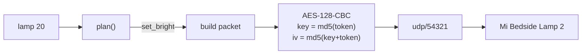

```
 ┃  ▄▄▄   ▗▄▄▄▖ ▗▖  ▗▖ ▗▄▄▖
 ┃ ▐▌  ▜▌ ▐▌ ▝▘ ▐▛▚▞▜▌ ▐▌ ▐▌
 ┃ ▐▌  ▐▌ ▐▛▀▀▘ ▐▌▝▘▐▌ ▐▛▀▘
 ┻ ▝▀▀▀▘ ▝▘     ▝▘  ▝▘ ▐▌
```

# lamp

Control the Mi Bedside Lamp 2 from the terminal. Entirely on your own network.

[](https://bun.sh)
[]()
[]()
[]()

```
lamp            # toggle
lamp 20         # 20% brightness
lamp 2700k      # warm white
lamp #ff3000    # colour
lamp @read      # a scene from your config
lamp status     # on  80%  4000K
lamp agent on   # follow the time of day, your music, and your theme
```

No cloud round trip, no hub, no Xiaomi or Yeelight app in the loop. The lamp's
HomeKit pairing is untouched, so the Home app keeps working on your phone
exactly as before.

## Run it

```bash
git clone https://github.com/nitrimandylis/lamp.git
cd lamp
bun run compile   # → ~/.bun/bin/lamp, and man lamp into your manpath
lamp --help
man lamp          # full reference, offline
```

## Setting it up

```bash
lamp setup
```

Opens a QR code, you scan it with the Xiaomi Home app, and it writes the device
address and token to `~/.config/lamp/config.toml` at mode 600. Deliberately
QR-based: the password login path returns `Access denied` on any account with
two-factor verification, and each attempt burns one of a 3–5 per day quota.

The token is a per-device credential. Once written you never need it again
unless the lamp is factory reset.

## Automating it

```bash
lamp agent on    # runs `lamp tick` every 30s
```

One reconciler, not a daemon and not a pile of calendar jobs. Each tick reads
the time, whether audio is playing, and the active theme, computes what the
lamp should look like, and sends only what differs. A steady state sends no
packets at all.

```toml
[[schedule]]
from = "18:00"
brightness = 50        # no kelvin: the theme accent shows through

[[schedule]]
from = "23:00"
brightness = 25
kelvin = 2200          # kelvin set: time takes the colour dimension

[media]
brightness = 30        # ceiling while audio plays; only ever dims
```

Colour and brightness are separate dimensions, but the lamp can only be in one
colour *mode* at a time, so the schedule breaks the tie: a slot naming a
`kelvin` claims colour for itself, and a slot without one lets the swatch accent
show. That is what makes the lamp go warm late at night under a bright theme.

Two rules stop it feeling haunted:

- **It never turns the lamp on.** Only ever adjusts one already on, so it cannot
  light an empty room. An unreachable lamp is a silent no-op.
- **Anything you type wins for two hours**, or until `lamp off`. Switching off is
  the natural "I'm done" signal and hands control straight back. `lamp auto`
  does the same without the lamp going off.

The theme colour is read out of swatch's own files — the active theme name from
the Ghostty config it generates, the accent from the palette beside it. swatch
is never modified and does not know this exists.

"Is audio playing" is the `coreaudiod` power assertion, so it covers Cider,
Music.app, `jazz` and the browser alike, with no API token and no polling.

## Under the hood



A miIO packet is a 32-byte header — magic, length, device id, the device's own
clock, and an md5 checksum — wrapped around an encrypted JSON body. The first
datagram is a handshake that asks the lamp for its id and clock; everything
after that is a `set_bright` / `set_ct_abx` / `set_rgb` call.

Argument parsing is a pure function, `plan()`, which turns one argument into the
list of calls that carry it out. That is where the whole command vocabulary
lives and it is tested without a lamp on the network.

## Why not the Yeelight LAN protocol

The Mi-branded MJCTD02YL ships with Yeelight's LAN control (tcp/55443) disabled
at the factory, and no firmware or app setting turns it back on. miIO on
udp/54321 is the only local path this device has.

## Development

```bash
bun test                     # pure logic, no lamp required
bunx --bun tsc --noEmit
mandoc -T lint man/lamp.1
```

MIT.
