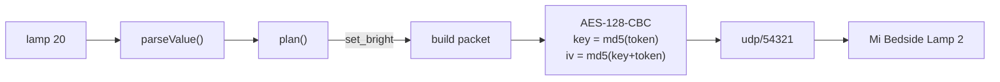

```
 ██╗      █████╗ ███╗   ███╗██████╗ 
 ██║     ██╔══██╗████╗ ████║██╔══██╗
 ██║     ███████║██╔████╔██║██████╔╝
 ██║     ██╔══██║██║╚██╔╝██║██╔═══╝ 
 ███████╗██║  ██║██║ ╚═╝ ██║██║     
 ╚══════╝╚═╝  ╚═╝╚═╝     ╚═╝╚═╝     
```

<div align="center">

### `LOCAL CONTROL // NO CLOUD, NO HUB, NO APP`

*a bedside lamp, one word away from the keyboard*


</div>

---

## 💡 What is this

A single binary that controls a Mi Bedside Lamp 2 over your own network. It speaks miIO, the protocol the lamp already answers on udp/54321, so nothing leaves the house: no account, no hub, no Xiaomi app in the loop. The lamp's HomeKit pairing keeps working exactly as before, because `lamp` never touches it.

It exists because the Home app on a Mac is useless without a home hub, and buying a HomePod to dim a lamp on the same Wi-Fi is an expensive way to avoid typing four characters.

The Mi-branded MJCTD02YL has Yeelight's LAN control switched off at the factory, and no firmware or setting turns it back on. Every guide telling you to enable developer mode is describing a device you do not own.

```console
nick@lamp:~$ lamp 20 && lamp warm
[✓] on  20%  2700K
[i] two udp packets. no server, no round trip through frankfurt.
```

## 🎛 The vocabulary

| | command | what it actually does |
|---|---|---|
| 01 | **`lamp`** | toggles. that is all it does, so never use it to reach a known state |
| 02 | **`lamp 20`** | brightness, 0 to 100. `lamp 0` is off, because you meant off |
| 03 | **`lamp 2700k`** | colour temperature, 1700 to 6500. the `k` is required so `20` and `2700` can never be confused |
| 04 | **`lamp red`** | 17 named colours, tuned for an led rather than a screen (`#0000ff` reads as dim violet on real hardware) |
| 05 | **`lamp @read`** | applies a saved scene. namespaced behind `@` so a scene can never collide with a built-in |
| 06 | **`lamp scene desk`** | saves whatever the lamp is showing right now. the values worth keeping are the ones you found by eye |
| 07 | **`lamp status`** | `on  80%  4000K`, in about 40ms |
| 08 | **`lamp setup`** | signs in to xiaomi, answers the captcha and the emailed code, hands you the device token. needed once, ever |

## 🚀 Run it

Needs [Bun](https://bun.sh) and a lamp on the same Wi-Fi.

```bash
git clone https://github.com/nitrimandylis/lamp.git
cd lamp
bun run compile   # → ~/.bun/bin/lamp, man lamp, and the agent skill
lamp setup
```

`setup` puts the device token on your clipboard. It goes in your environment, never in a file:

```bash
echo 'export LAMP_TOKEN=<paste>' >> ~/.zsh_secrets
```

Pick a file your shell exports but your dotfiles repo does not track. The `export` matters: a bare assignment is a shell variable, and child processes never see it. With the token outside the config, `config.toml` holds nothing secret and can be read, synced or committed without thinking about it.

## 🤖 For agents

`lamp-cli/SKILL.md` ships in the repo and installs itself on compile. It carries the part `--help` has no room for: every command is safe to run unattended except `lamp setup`, which reads a password in raw mode and will hang a tool call forever waiting for input nobody is going to type.

It also lists the traps. A timeout means an unreachable lamp *or* a wrong token and cannot tell you which, since the device silently drops packets that fail their checksum. `lamp scene rm` deletes without asking.

## 🔩 Under the hood



A miIO packet is a 32-byte header (magic, length, device id, the device's own clock, an md5 checksum) wrapped around an encrypted JSON body. The first datagram is a handshake asking the lamp for its id and clock. Everything after that is `set_bright`, `set_ct_abx` or `set_rgb`.

| file | job |
|---|---|
| `lamp.ts` | the command vocabulary. `parseValue()` is the single definition of what `80`, `2700k` and `red` mean, so the cli and scene building can never disagree |
| `miio.ts` | the protocol in 127 lines. aes, checksums, handshake, and three retries because the lamp's wi-fi sleeps and udp does not retransmit |
| `cloud.ts` | one-time token retrieval. the captcha and 2fa flows are the reason it works where `miiocli cloud` returns access denied |
| `lamp-cli/` | the agent-facing doc, copied into `~/.claude/skills` on compile |

There is no scheduling, no sunrise, no dim-at-11pm. A reconciler on a 30-second launch agent was built, worked, and got deleted: every rule needed a guard to stop it feeling haunted, and when the guards are the interesting part, the feature is arguing with its user.

**Stack:** bun · typescript · node:dgram · node:crypto · zero runtime dependencies

---

<div align="center">

**[Nick Trimandylis](https://github.com/nitrimandylis)**

`THE LAMP IS ON THE LAN. THAT IS THE WHOLE ARCHITECTURE`

MIT licensed.

</div>
