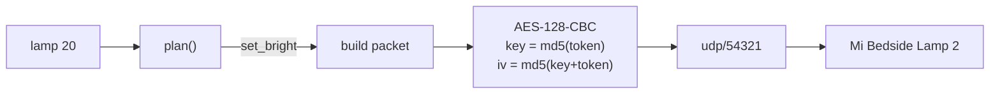

```
 ┃  ▄▄▄   ▗▄▄▄▖ ▗▖  ▗▖ ▗▄▄▖
 ┃ ▐▌  ▜▌ ▐▌ ▝▘ ▐▛▚▞▜▌ ▐▌ ▐▌
 ┃ ▐▌  ▐▌ ▐▛▀▀▘ ▐▌▝▘▐▌ ▐▛▀▘
 ┻ ▝▀▀▀▘ ▝▘     ▝▘  ▝▘ ▐▌
```

# lamp

Control the Mi Bedside Lamp 2 from the terminal. Entirely on your own network.

[](https://bun.sh)
[]()
[]()
[]()

```
lamp            # toggle
lamp 20         # 20% brightness
lamp 2700k      # warm white
lamp red        # a named colour
lamp #ff3000    # or hex
lamp @read      # a scene from your config
lamp status     # on  80%  4000K
```

No cloud round trip, no hub, no Xiaomi or Yeelight app in the loop. The lamp's
HomeKit pairing is untouched, so the Home app keeps working on your phone
exactly as before.

## Run it

```bash
git clone https://github.com/nitrimandylis/lamp.git
cd lamp
bun run compile   # → ~/.bun/bin/lamp, and man lamp into your manpath
lamp --help
man lamp          # full reference, offline
```

## Setting it up

```bash
lamp setup
```

Asks for your Xiaomi account and password, answers the captcha and emailed
two-factor code if the account demands them, then writes the device address and
token to `~/.config/lamp/config.toml` at mode 600. The password is not echoed
and never touches disk.

Handling both challenges is the whole point. The naive password login — the one
`miiocli cloud` performs — returns `Access denied` on any account with
verification enabled, which is most of them.

The token is a per-device credential. Once written you never need it again
unless the lamp is factory reset.

## Colours

```
red  orange  amber  yellow  lime  green  mint  teal  cyan
azure  blue  indigo  violet  purple  magenta  pink  white
```

Tuned for an LED, not a screen: `#0000ff` reads as a dim violet on this lamp and
`#ffff00` washes out to near-white, so the built-ins are pulled towards what the
device actually shows. Yours will differ by bulb and by room, so override the
ones you disagree with:

```toml
[colours]
blue = "#0033cc"
```

Overrides apply one at a time, so changing `blue` leaves the rest alone.

## Under the hood



A miIO packet is a 32-byte header — magic, length, device id, the device's own
clock, and an md5 checksum — wrapped around an encrypted JSON body. The first
datagram is a handshake that asks the lamp for its id and clock; everything
after that is a `set_bright` / `set_ct_abx` / `set_rgb` call.

Argument parsing is a pure function, `plan()`, which turns one argument into the
list of calls that carry it out. That is where the whole command vocabulary
lives and it is tested without a lamp on the network.

## Why not the Yeelight LAN protocol

The Mi-branded MJCTD02YL ships with Yeelight's LAN control (tcp/55443) disabled
at the factory, and no firmware or app setting turns it back on. miIO on
udp/54321 is the only local path this device has.

## Development

```bash
bun test                     # pure logic, no lamp required
bunx --bun tsc --noEmit
mandoc -T lint man/lamp.1
```

MIT.
